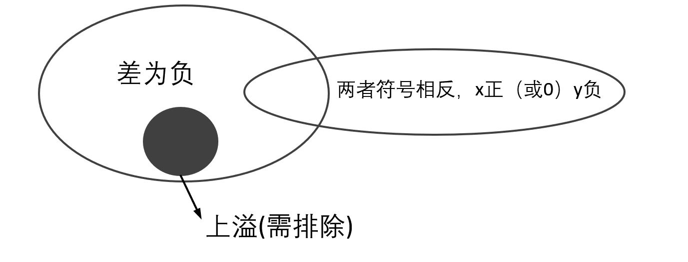
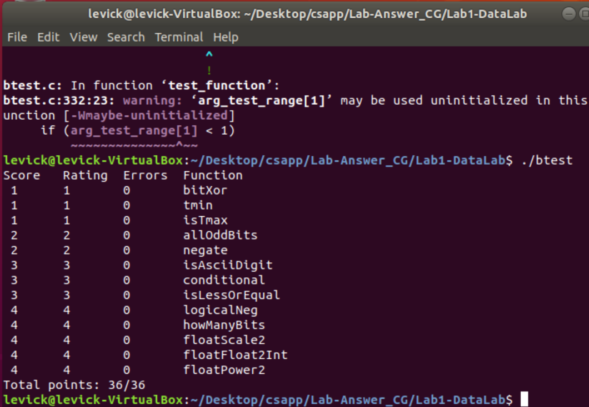

# Lab1-DataLab-Note

可以在本md中记录学习心得, 经验, 总结, 以及走过的坑!

`Notes by Levick Cheng` 网页阅读请安装[MathJax Plugin for Github](https://chrome.google.com/webstore/detail/mathjax-plugin-for-github/ioemnmodlmafdkllaclgeombjnmnbima?hl=zh-CN)

`Please read problems think thoroughly before you check this notes`

[reference1](https://wdxtub.com/csapp/thick-csapp-lab-1/2016/04/16/)

[reference2](https://zhuanlan.zhihu.com/p/59534845?utm_source=qq)

`Note:`请在纯linux环境中按照datalab.pdf的操作步骤运行（实测win、ras-pi ，make失败），并且请安装`gcc-multilib`，sudo apt-get install gcc-multilib, 即可。

首先弄复习一遍操作符含义

> !  逻辑取反
>
> ~ 按位取反
>
> & 按位与
>
> ^ 按位异或
>
> |  按位或
>
> << （算数）左移
>
> \>>    (算数)右移
>
> 优先级：`！`> `~`  > `-(负号` > `+` > `-` >`<<` >`>>`>`&` > `^` > `|` 

## 1.bitXor
要求：

```c++
 \* bitXor - x^y using only ~ and & 
 \*  Example: bitXor(4, 5) = 1
 \*  Legal ops: ~ &
 \*  Max ops: 14
 \*  Rating: 1
```

首先进行位异或，我们需要清楚`异或(^)等于什么`，根据定义，我们知道

​                                                                   $Z = X \oplus Y = X\overline Y  + \overline X Y$

但是我们没有或（or）操作符，所以我们需要通过~（not，非）和&（and，与）来得到。


​							                                              $X + Y= \sim(XY)=\sim x\&\sim y$

故答案可以为：

```c
int bitXor(int x, int y) {
  int o1=x&(~y);
  int o2=(~x)&y;
  return ~(~o1&~o2);
}
```

## 2.Tmin

要求：

```C	
 * tmin - return minimum two's complement integer 
 *   Legal ops: ! ~ & ^ | + << >>
 *   Max ops: 4
 *   Rating: 1
```

首先明确最小整型补码是`1000...00000`，而我们可以用移位操作，那就十分明了了，只需要`000...0001`左移31位即可得到（默认int为32位）,`return 1<<31`

## 3.isTmax

requirement:

```C	
 * isTmax - returns 1 if x is the maximum, two's complement number,
 *     and 0 otherwise 
 *   Legal ops: ! ~ & ^ | +
 *   Max ops: 10
 *   Rating: 1
```

Tmax:`0111...111`, Tmin:`1000...000`,  那么Tmin左移得全0，那么我们直接将x左移1位看他是不是全0，但是需要注意到特殊情况，x本身就是全0。

Answer：

```c
int isTmax(int x) {
  int tmp=~x;
  return !(2*tmp)&!(!tmp);
}
```

## 4.allOddBits

requirement:

```c	
 * allOddBits - return 1 if all odd-numbered bits in word set to 1
 *   where bits are numbered from 0 (least significant) to 31 (most significant)
 *   Examples allOddBits(0xFFFFFFFD) = 0, allOddBits(0xAAAAAAAA) = 1
 *   Legal ops: ! ~ & ^ | + << >>
 *   Max ops: 12
 *   Rating: 2
```

稍微解释一下题目，奇数位全1则返回1，反之返回0

从结果出发，我们的结果需要为全0或者全1的一个数，然后进行操作返回。奇数位全为1,那我们将x右移一位然后和0xAAAAAAAA按位或就可以得到全1了。至于0xAAAAAAAA我们可以通过移位得到（因为赋值得到的int只能在0~255之间）

Answer:

```c
int allOddBits(int x) {
  int a= 0xAA;
  int b=(a<<8)+a;//0x AA AA
  int c=(b<<16)+b;//0X AA AA AA AA
  return !((c | (x>>1))+1);
//  return !((c&x)^c);// this one ok too;
}
```

## 5.negate

requirement:

```c
* negate - return -x 
 *   Example: negate(1) = -1.
 *   Legal ops: ! ~ & ^ | + << >>
 *   Max ops: 5
 *   Rating: 2
```

这题比较简单，计算机通过补码解释int，补码取反怎么操作？取反加一。

```c
int negate(int x) {
  return ~x+1;
}
```

## 6.isAsciiDigit

requirement:

```c
* isAsciiDigit - return 1 if 0x30 <= x <= 0x39 (ASCII codes for characters '0' to '9')
 *   Example: isAsciiDigit(0x35) = 1.
 *            isAsciiDigit(0x3a) = 0.
 *            isAsciiDigit(0x05) = 0.
 *   Legal ops: ! ~ & ^ | + << >>
 *   Max ops: 15
 *   Rating: 3
```

判断ascII值是不是0到9，首先我们明确，‘0’=48=0x30，‘9’=58=0x39，所输入x应该在此范围内，x-‘0’>=0,x-'9'<=0.

如何实现减法？补码减法直接取反加一，因此，x-'0'=x+(\~48+1)，57-x=57+\~x+1。

故，参考答案如下：

```c
int isAsciiDigit(int x) {
  return !(( (x+(~48+1))>>31 )| ( (57+(~x+1))>>31 ));
}
```

##7. conditional

requirement:

```c
/* 
 * conditional - same as x ? y : z 
 *   Example: conditional(2,4,5) = 4
 *   Legal ops: ! ~ & ^ | + << >>
 *   Max ops: 16
 *   Rating: 3
 */
```

​	我们通过逻辑取反可以得到x是否为0, 而为了实现x?y:z，我们可以化简为：

​	(a&y)|(b&z)，x为0时，a全0，b全1，返回z；x为1时，a全1，b全0，返回y。根据赋值，a=!x+\~1+1，b=\~!x+1

故，参考答案如下：

```c
int conditional(int x, int y, int z) {
  return ((!x+~1+1)&y)+((~!x+1)&z);
}
```

## 8.isLessOrEqual

requirement:

```c
/* 
 * isLessOrEqual - if x <= y  then return 1, else return 0 
 *   Example: isLessOrEqual(4,5) = 1.
 *   Legal ops: ! ~ & ^ | + << >>
 *   Max ops: 24
 *   Rating: 3
 */
```

​	这题乍看很简单，经过初步分析你可能得出以下思路：

`判断x,y大小关系，那我们可以用y-x，若结果符号为正（0）则说明x<=y，返回1，若符号为负（1），则说明x>y返回0，结果可以通过符号位取反得到`

​	同学醒醒，这题三分呢，咋会两行就出答案（至少这题不是哦）。我们还需要郑重地考虑溢出的问题，单用差的符号位判断的是未溢出的情况；对于溢出我们还应该判断是上溢（超过所能表示最大整数）还是下溢（小于所能表示最小负数），如果是下溢，则也应该返回1；另外我们还要排除上溢的情况。

​	总得来说就是以下三种情况：

> - 差符号为1
>   - 加上下溢的
>   - 提出上溢的

故参考答案如下：

```c
int isLessOrEqual(int x, int y) {
  int xsign=(x>>31)&1;//get the sign bit of x
  int ysign=(y>>31)&1;//get the sign bit of y
  int dif=(y+~x+1);//difference of x&y
  int dif_sign=(dif>>31)&1;//sign bit of dif
  int vf=(xsign&ysign&(!dif_sign))|((!xsign)&(!ysign)&dif_sign);//spillover?
  int is_opp=(xsign^ysign)&(xsign);//x>=0,y<0
  int overflow=(!vf)&(!xsign)&ysign;//positive spillover
  return ((!dif_sign)|is_opp)&(!overflow);
}
```

你可能会问的问题。

问：为什么你直接is_opp和！dir_sign相或，不是说好了求负溢出吗？，is_opp只是表示两数符号相反且x正（或0），y负，但是包含了负溢出的情况且其他情况，所以和dif_sign直接相或。又不能是正溢出，前两者相或的结果与!overflow相与即可。图胜千言，如下。



## 9.logicalNeg

requirement:

```c
/* 
 * logicalNeg - implement the ! operator, using all of 
 *              the legal operators except !
 *   Examples: logicalNeg(3) = 0, logicalNeg(0) = 1
 *   Legal ops: ~ & ^ | + << >>
 *   Max ops: 12
 *   Rating: 4 
 */
```

逻辑取反最后的结果是0和1，且只有全0是返回1，其他情况返回均返回0。那么问题来了，如果区别全0？

​	我们可以利用补码和其相反数的一个性质，0取反还是0，但是其他数取反为其相反数。0|0=0, x|(~x+1)<0, 将x和其相反数按位或则得到0或一个负数，右移31根据其符号位可以得到我们想要的结果。

故参考答案如下：

```c
int logicalNeg(int x) {
  return ((x|(~x+1))>>31)+1;
}
```

## 10.howManyBits

requirement:

```c
/* howManyBits - return the minimum number of bits required to represent x in
 *             two's complement
 *  Examples: howManyBits(12) = 5
 *            howManyBits(298) = 10
 *            howManyBits(-5) = 4
 *            howManyBits(0)  = 1
 *            howManyBits(-1) = 1
 *            howManyBits(0x80000000) = 32
 *  Legal ops: ! ~ & ^ | + << >>
 *  Max ops: 90
 *  Rating: 4
 */
```

​	根据观察我们发现，正数（或0）中符号位后第一串连续的0和负数中符号位后第一串连续的1去掉后不影响结果，也就是说我们需要在正数里面找1，负数里面找0。但是我们不能使用条件语句，所以我们需要转换。这里我们采用对正数的判断方法，如果不是正数则按位取反，最后结果是一致的（比如-1，1111，最少需要1位，结果为1；取反为0000，按正数判断方法也是最少需要一位0，结果仍然是1）。

​	如何做到正数不变，负数按位取反？

​	令`int sign = x>>31`，若x为正数或0，sign为全0，若x为负数，sign为全1（算术右移，要补符号位），然后再令 $x=sign \oplus x$ ，（比如$ 1111 \oplus 1101=0010 $ ,转换后结果仍为3）即可。

​	之后我们的任务就是找出x中的1，对此我们采用2分法，即16->8>4>2>1>0的步长依次移位确定1的位置。

故参考答案如下：

```c
int howManyBits(int x) {
    int sign=x>>31;
    x=(sign&~x)|(~sign&x);//negative:negate by bits,else unchanged
    int b16,b8,b4,b2,b1,b0;//to see if there is 1 in relative bit
    b16=!!(x>>16)<<4;//found 1 in first 16 bits?
    x=x>>b16;//if so,right shift 16 bits, else 0 bit
    b8=!!(x>>8)<<3;//found 1 in next 8 bits?
    x=x>>b8;//if so,right shift 8 bits, else 0 bits
    b4=!!(x>>4)<<2;//same as above
    x=x>>b4;
    b2=!!(x>>2)<<1;
    x=x>>b2;
    b1=!!(x>>1);
    x=x>>b1;
    b0=x;
    return b16+b8+b4+b2+b1+b0+1;//b0 is actually 0, 1 here is the sign bit.
}
```
## 11.floatScale2

requirement:

```c
//float
/* 
 * floatScale2 - Return bit-level equivalent of expression 2*f for
 *   floating point argument f.
 *   Both the argument and result are passed as unsigned int's, but
 *   they are to be interpreted as the bit-level representation of
 *   single-precision floating point values.
 *   When argument is NaN, return argument
 *   Legal ops: Any integer/unsigned operations incl. ||, &&. also if, while
 *   Max ops: 30
 *   Rating: 4
 */
```

简单释义：返回 输入浮点数f的两倍的（NaN时返回本身），输入与输出均为unsigned。

简单回顾一下IEEE-754标准的浮点数


> 于是我们应该根据Exp分情况处理
>
> - 特殊值（Exp全1），正负无穷两倍还是无穷，NaN仍未NaN，所以直接返回uf即可
> - 非规格化浮点数，左移一位或上符号位即可（由于连续性，不用担心范围）
> - 规格化浮点数，exp+1即可（注意exp+1后的值与255比较，若相等返回相应无穷大）

故参考答案如下：

```c
unsigned floatScale2(unsigned uf) {
  int exp=(uf&0x7f800000)>>23;//obtain the value of E
  int sign=uf&(1<<31);//if negative,0x10000000,else, 0x00000000
  if(exp==255) return uf;
  if(exp==0) return uf<<1|sign;
  exp++;
  if(exp==255) return 0x7f800000|sign;//return infinite
  return (exp<<23)|(uf&0x807fffff);
}
```

## 12 floatFloat2Int

requirement:

```c
/* 
 * floatFloat2Int - Return bit-level equivalent of expression (int) f
 *   for floating point argument f.
 *   Argument is passed as unsigned int, but
 *   it is to be interpreted as the bit-level representation of a
 *   single-precision floating point value.
 *   Anything out of range (including NaN and infinity) should return
 *   0x80000000u.
 *   Legal ops: Any integer/unsigned operations incl. ||, &&. also if, while
 *   Max ops: 30
 *   Rating: 4
 */
```

简言之就是将单精度浮点数转换为整数，且所有不在表示范围内的数都应该返回0x80000000。

（uf是32位无符号整数，题目要求我们将其按照浮点数来解释并返回相应的整数值）

题目其实就是考察我们对浮点数的理解，要将一串二进制数转换成整数真值。

规格化浮点数时：$(-1)^s\times(2)^{E}\times1.M$

非规格化浮点数时：$(-1)^s\times(2)^{E}\times M$,但是非规格化浮点数在小于1，就直接返回0了。

同时，我们要考虑到单精度浮点数表示范围比int大，（int在-2\^31~2\^31-1之间），所以需要考虑过大和过小的舍入问题。

参考答案如下：

```c
int floatFloat2Int(unsigned uf) {
    int sign=uf>>31&1;
    int frac=uf&0x007fffff;//get frac bits
    int exp=(uf>>23)&0xff;//get exp bits
    //now convert 
    int E=exp-127;//single precision,bias is 127
    //pay attention to the difference between E and frac
    if(exp==255||E>30){
	    return 0x80000000u;}//too large too represent(abs>2^31) 
    else if(E<0||!exp){
	    return 0;}//too small to represent(<1),cast to 0
    //add 1 to the front to normalize
    frac=frac|1<<23;
    if(E>23){
	    frac=frac<<(E-23);} 
    else{
	    frac=frac>>(23-E);}
    if(sign){
            return ~frac+1;}//original number was negative,negate.    
    return frac;
}
```

函数主要过程：首先得到sign，frac，exp和E，（注意阶码E和阶码位frac的区别）。

然后我们根据exp和E来分情况讨论（最终我们通过frac移位运算来得到我们的结果）。

> - exp==255，全1，为特殊值（无穷或NaN）_或_E>30在int表示范围外，按题目要求返回0x80000000u
>   - 特别的为什么是E>30而不是31呢，int绝对值小于`2^31`，在最小值取到。因为规格化浮点数M有默认的1，所以就算是表示最小值也只有在（0xcf000000）时可以表示，但正好返回	0x80000000u被解释为最小负数-2147483648。（自己可以调试一下理解过程，输入值为3472883712）。于是只要E>30即可，int最小值这一边界情况刚好覆盖。
> - E<0或exp==0，E<1说明表示的为<1的数，exp全0说明是denorm，也小于1，返回0
> -  规格化浮点数，正常进行移位运算。（注意在最前面加一以标准化）
>   - 真值=$(-1)^s\times(2)^{E}\times1.M$
>   - 为什么是23？frac有23位，我们直接解释的话已经将结果左移了23位，所以阶码E的值要减去23.
> - 如果之前符号为负，取反。因为用frac储存答案，默认为正

## 13. floatPower2

requirement:

```c
/* 
 * floatPower2 - Return bit-level equivalent of the expression 2.0^x
 *   (2.0 raised to the power x) for any 32-bit integer x.
 *
 *   The unsigned value that is returned should have the identical bit
 *   representation as the single-precision floating-point number 2.0^x.
 *   If the result is too small to be represented as a denorm, return
 *   0. If too large, return +INF.
 * 
 *   Legal ops: Any integer/unsigned operations incl. ||, &&. Also if, while 
 *   Max ops: 30 
 *   Rating: 4
 */
```

这道题要求我们返回2的x次幂，超范围则返回正无穷，过小则返回0。

相对来说十分简单，参考答案如下：

```c
unsigned floatPower2(int x) {
    int INF=0xff<<23;//positive infinite
    int exp=x+127;//x=E=exp-127
    if(exp<0) return 0;//too small for fp number,cast to 0
    if(exp>=255) return INF;    
    return exp<<23;
}
```

有同学可能会超时，可能是CPU性能不够，可以将btest文件里的时间限制double，或者make文件-m32换成-m64。

## 测试代码

直接在bits.c文件中不易调试，这里给出测试代码一个简单的模板。可以自己测试一下边界&特殊情况。

```c++
#include <iostream>

using namespace std;

int float_f2i(unsigned uf) {
	int exp = (uf >> 23) & 0xFF;
	int frac = uf & 0x007FFFFF;
	int sign = uf & 0x80000000;
	int bias = exp - 127;

	if (exp == 255 || bias > 30) {
		// exponent is 255 (NaN), or number is too large for an int
		return 0x80000000u;
	}
	else if (!exp || bias < 0) {
		// number is very small, round down to 0
		return 0;
	}

	// append a 1 to the front to normalize
	frac = frac | 1 << 23;

	// float based on the bias
	if (bias > 23) {
		frac = frac << (bias - 23);
	}
	else {
		frac = frac >> (23 - bias);
	}

	if (sign) {
		// original number was negative, make the new number negative
		frac = ~(frac)+1;
	}

	return frac;
}
int main()
{
	unsigned x;//if two variable then Datatype x,y;
    //int x,y;
    //usigned x,y;
	while (true)
	{
		cin >> x;//if there is another variable, cin>>x>>y;
		if (!cin) { break; }
        //printf("%08x",function_name(variable1,variable2_If_exits));
        //use 0x%08x to print the variable in hexadecimal and line up
		int y = float_f2i(x);
		printf("%d", y);
		cout << endl;
	}
	return 0;
}


```



最后附上测试结果图，所有代码均通过测试。